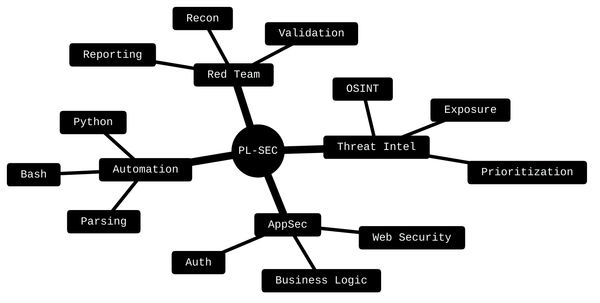

<!--
  PROFILE README // PEDRO LIMA
  EDITION: V6 PREMIUM // SIGINT OPERATOR FINAL BUILD
  THEME: Amber Phosphor // Dark Intelligence Panel
  STYLE: Red Team | Threat Intel | AppSec | OSINT | Offensive Security
-->


<p align="center">
  
</p>

<p align="center">
  
  
  
  
</p>

<p align="center">
  <a href="https://www.linkedin.com/in/pedro-lima-sec">
    
  </a>
  <a href="mailto:pedrovitor.lima211@gmail.com">
    
  </a>
  <a href="https://github.com/pedrolima-sec?tab=repositories">
    
  </a>
</p>

---

<div align="center">

```txt
╔══════════════════════════════════════════════════════════════════════════════╗
║                     SIGINT // SPECOPS SEC // OPERATOR PROFILE              ║
╠══════════════════════════════════════════════════════════════════════════════╣
║  Identity      : Pedro Lima                                                 ║
║  Callsign      : PL-SEC                                                     ║
║  Domain        : Offensive Security                                         ║
║  Focus         : Red Team | Threat Intel | AppSec | OSINT                   ║
║  Method        : Recon → Validate → Evidence → Report                       ║
║  Operating Mode: Learning by doing | Method over noise                      ║
║  Principle     : Ethics, authorization, precision and discipline            ║
║  Signature     : Context before exploitation.                               ║
╚══════════════════════════════════════════════════════════════════════════════╝
```

</div>

---

## 01 // OPERATOR PROFILE

Atuo em Segurança da Informação com foco em **Red Team**, **Threat Intelligence**, **AppSec**, **OSINT** e **análise de superfície de ataque**.

Minha evolução é guiada por método: **reconhecer, entender, validar, documentar e comunicar risco com clareza**.

Não busco apenas executar ferramentas. Busco entender o ambiente, reduzir ruído, validar impacto e transformar evidências técnicas em decisão.

```txt
┌──(pedro㉿redteam)-[~/operator-profile]
└─$ whoami

[+] Information Security Student
[+] Red Team Operator in Progress
[+] Threat Intelligence Driven
[+] Web Security & AppSec Focused
[+] OSINT & Surface Mapping Oriented
[+] Learning by Doing
[+] Method over Noise
```

---

## 02 // MISSION BRIEF

```txt
┌─ MISSION BRIEF ──────────────────────────────────────────────────────────┐
│                                                                          │
│  Objective     : Build offensive security capability with method          │
│  Focus Area    : Red Team | Threat Intel | AppSec | OSINT                 │
│  Current Phase : Foundation → Practice → Operational maturity             │
│  Approach      : Learn, validate, document and communicate                │
│  Constraint    : Authorized operations only                               │
│                                                                          │
└──────────────────────────────────────────────────────────────────────────┘
```

<table>
  <tr>
    <td width="25%">
      <h3 align="center">RECON</h3>
      <p align="center">Mapear superfície, ativos, exposição e contexto antes de qualquer conclusão.</p>
    </td>
    <td width="25%">
      <h3 align="center">INTEL</h3>
      <p align="center">Coletar sinais, reduzir ruído, correlacionar evidências e priorizar riscos.</p>
    </td>
    <td width="25%">
      <h3 align="center">VALIDATE</h3>
      <p align="center">Confirmar hipóteses com responsabilidade, autorização e precisão técnica.</p>
    </td>
    <td width="25%">
      <h3 align="center">REPORT</h3>
      <p align="center">Traduzir achados em evidência, impacto e decisão técnica ou executiva.</p>
    </td>
  </tr>
</table>

---

## 03 // OPERATING DOCTRINE

```txt
┌─ DOCTRINE ───────────────────────────────────────────────────────────────┐
│                                                                          │
│  Recon before action.                                                    │
│  Context before exploitation.                                             │
│  Evidence before conclusion.                                              │
│  Communication before impact.                                             │
│  Discipline before execution.                                             │
│                                                                          │
└──────────────────────────────────────────────────────────────────────────┘
```

```txt
METHOD     > NOISE
CONTEXT    > HYPE
EVIDENCE   > ASSUMPTION
DISCIPLINE > IMPULSE
```

---

## 04 // CAPABILITY MATRIX

<table>
  <tr>
    <td width="50%">
      <h3>⚔️ Offensive Security</h3>
      <p>Validação técnica de riscos, análise de exposição, exploração responsável e documentação em ambientes autorizados.</p>
    </td>
    <td width="50%">
      <h3>🛰️ Threat Intelligence</h3>
      <p>Coleta e análise de sinais externos, priorização de achados e apoio à tomada de decisão técnica.</p>
    </td>
  </tr>
  <tr>
    <td width="50%">
      <h3>🧩 Application Security</h3>
      <p>Análise de aplicações web, autenticação, autorização, lógica de negócio, exposição de dados e headers de segurança.</p>
    </td>
    <td width="50%">
      <h3>⚙️ Offensive Automation</h3>
      <p>Scripts e fluxos para enumeração, parsing, organização de evidências e apoio operacional em segurança ofensiva.</p>
    </td>
  </tr>
</table>

```txt
┌─ CAPABILITY GRID ────────────────────────────────────────────────────────┐
│                                                                          │
│  [01] Reconnaissance      → superfície, ativos expostos e contexto         │
│  [02] Threat Intelligence → sinais externos, priorização e evidências      │
│  [03] Web Security        → autenticação, autorização e lógica web         │
│  [04] AppSec              → validação técnica de riscos reais              │
│  [05] OSINT               → investigação em fontes públicas                │
│  [06] Automation          → Python, Bash, parsing e apoio operacional      │
│  [07] Reporting           → comunicação técnica e executiva                │
│                                                                          │
└──────────────────────────────────────────────────────────────────────────┘
```

---

## 05 // MISSION PIPELINE


```txt
RECON ──► INTEL ──► HYPOTHESIS ──► VALIDATION ──► EVIDENCE ──► REPORT ──► IMPROVEMENT
```

---

## 06 // OPERATOR RULESET

> Ferramentas mudam.
> Fundamentos permanecem.
> O operador evolui quando aprende a pensar antes de executar.

```txt
┌─ OPERATOR RULESET ───────────────────────────────────────────────────────┐
│                                                                          │
│  [01] Never confuse activity with progress.                               │
│  [02] Never report what cannot be explained.                              │
│  [03] Never exploit without context and authorization.                     │
│  [04] Never let the tool think for the operator.                           │
│  [05] Never trade evidence for assumptions.                                │
│  [06] Never ignore business impact.                                        │
│  [07] Never communicate noise as risk.                                     │
│                                                                          │
└──────────────────────────────────────────────────────────────────────────┘
```

---

## 07 // TECHNICAL ARSENAL

<p align="center">
  
</p>

<p align="center">
  
  
  
  
  
</p>

<table>
  <tr>
    <td width="33%">
      <h3>Systems</h3>
      <p>Linux<br/>Kali Linux<br/>Windows</p>
    </td>
    <td width="33%">
      <h3>Languages</h3>
      <p>Python<br/>Bash<br/>JavaScript</p>
    </td>
    <td width="33%">
      <h3>Workflow</h3>
      <p>Git<br/>Docker<br/>Markdown</p>
    </td>
  </tr>
  <tr>
    <td width="33%">
      <h3>WebSec</h3>
      <p>Burp Suite<br/>OWASP ZAP<br/>HTTP Analysis</p>
    </td>
    <td width="33%">
      <h3>Network</h3>
      <p>Wireshark<br/>TCP/IP<br/>Traffic Analysis</p>
    </td>
    <td width="33%">
      <h3>Intel</h3>
      <p>OSINT<br/>Surface Mapping<br/>Evidence Tracking</p>
    </td>
  </tr>
</table>

---

## 08 // CURRENT OBJECTIVES

```txt
┌─ ACTIVE OBJECTIVES ──────────────────────────────────────────────────────┐
│                                                                          │
│  [ACTIVE] CompTIA Security+ SY0-701                                       │
│  [ACTIVE] Web Security Labs                                               │
│  [ACTIVE] Offensive Security Automation                                   │
│  [ACTIVE] Active Directory Security                                       │
│  [ACTIVE] Threat Intelligence Workflows                                   │
│  [ACTIVE] Red Team Methodology                                            │
│  [ACTIVE] Technical & Executive Reporting                                 │
│                                                                          │
└──────────────────────────────────────────────────────────────────────────┘
```

<table>
  <tr>
    <td width="33%">
      <h3>Primary Track</h3>
      <p><strong>Security+ SY0-701</strong><br/>Base sólida em segurança, risco, arquitetura, operações e resposta.</p>
    </td>
    <td width="33%">
      <h3>Practical Track</h3>
      <p><strong>Web Security Labs</strong><br/>Estudo prático de aplicações, autenticação, autorização e exposição.</p>
    </td>
    <td width="33%">
      <h3>Operational Track</h3>
      <p><strong>Red Team Methodology</strong><br/>Evolução em método, evidência, relatório e simulação ofensiva autorizada.</p>
    </td>
  </tr>
</table>

---

## 09 // FIELD DOSSIERS

<table>
  <tr>
    <td width="50%">
      <h3>DOSSIER-01 // Security+ SY0-701 Simulator</h3>
      <p><strong>Type:</strong> Study Platform</p>
      <p><strong>Status:</strong> Active Development</p>
      <p><strong>Objective:</strong> Aprendizado por simulação, revisão orientada e análise de desempenho.</p>
      <p>Simulador interativo para preparação Security+ com questões, explicações, trilhas de estudo e revisão baseada em desempenho.</p>
    </td>
    <td width="50%">
      <h3>DOSSIER-02 // Web Security Labs</h3>
      <p><strong>Type:</strong> Practical Lab</p>
      <p><strong>Status:</strong> Building</p>
      <p><strong>Objective:</strong> Consolidar fundamentos de segurança web em prática controlada.</p>
      <p>Laboratórios práticos com foco em autenticação, autorização, exposição de dados, headers e lógica de aplicação.</p>
    </td>
  </tr>
  <tr>
    <td width="50%">
      <h3>DOSSIER-03 // OSINT & Threat Intel Notes</h3>
      <p><strong>Type:</strong> Intelligence Notes</p>
      <p><strong>Status:</strong> Continuous</p>
      <p><strong>Objective:</strong> Organizar metodologia de investigação e correlação de sinais externos.</p>
      <p>Anotações, fluxos e metodologia para investigação de ativos expostos, fontes públicas, sinais externos e evidências.</p>
    </td>
    <td width="50%">
      <h3>DOSSIER-04 // Offensive Security Automation</h3>
      <p><strong>Type:</strong> Operational Scripts</p>
      <p><strong>Status:</strong> Evolving</p>
      <p><strong>Objective:</strong> Automatizar etapas repetíveis sem perder controle técnico.</p>
      <p>Scripts para enumeração, parsing, análise de respostas HTTP, organização de evidências e apoio a atividades autorizadas.</p>
    </td>
  </tr>
</table>

---

## 10 // KNOWLEDGE MAP



---

## 11 // OPERATIONAL SNAPSHOT

```txt
┌─ OPERATIONAL SNAPSHOT ───────────────────────────────────────────────────┐
│                                                                          │
│  Status        : Building offensive security capabilities                 │
│  Track         : Red Team | Threat Intel | AppSec | OSINT                 │
│  Focus         : Method, evidence, reporting and practical execution      │
│  Learning Mode : Labs, notes, automation, documentation and simulation    │
│  Current Phase : Foundation → Practice → Operational maturity             │
│                                                                          │
└──────────────────────────────────────────────────────────────────────────┘
```

<table>
  <tr>
    <td width="33%">
      <h3 align="center">SIGNAL</h3>
      <p align="center">Threat Intelligence, OSINT, exposição externa e correlação de evidências.</p>
    </td>
    <td width="33%">
      <h3 align="center">ACCESS</h3>
      <p align="center">Web Security, autenticação, autorização, lógica de aplicação e AppSec.</p>
    </td>
    <td width="33%">
      <h3 align="center">EVIDENCE</h3>
      <p align="center">Documentação, validação técnica, impacto e comunicação executiva.</p>
    </td>
  </tr>
</table>

```txt
┌─ DEVELOPMENT VECTOR ─────────────────────────────────────────────────────┐
│                                                                          │
│  Security+ SY0-701        █████████░░░  foundation building               │
│  Web Security Labs        ████████░░░░  practical validation              │
│  Threat Intel Workflows   ███████░░░░░  signal processing                 │
│  Offensive Automation     ██████░░░░░░  repeatable execution              │
│  Red Team Methodology     ███████░░░░░  operational maturity              │
│                                                                          │
└──────────────────────────────────────────────────────────────────────────┘
```

---

## 12 // SIGNAL BOARD

```txt
┌─ SIGNAL BOARD ───────────────────────────────────────────────────────────┐
│                                                                          │
│  Red Team        : mindset, method, validation and reporting              │
│  Threat Intel    : external signals, exposure and prioritization          │
│  AppSec          : web security, auth, headers and business logic          │
│  OSINT           : public sources, correlation and evidence               │
│  Automation      : scripts, parsing, repeatability and efficiency          │
│  Reporting       : technical clarity, executive context and action         │
│                                                                          │
└──────────────────────────────────────────────────────────────────────────┘
```

---

## 13 // CONTACT CHANNEL

<p align="center">
  <a href="https://www.linkedin.com/in/pedro-lima-sec">
    
  </a>
  <a href="mailto:pedrovitor.lima211@gmail.com">
    
  </a>
  <a href="https://github.com/pedrolima-sec?tab=repositories">
    
  </a>
</p>

---

<div align="center">

```txt
┌── FINAL TRANSMISSION
│
├─ Identity     : Offensive Security
├─ Callsign     : PL-SEC
├─ Focus        : Red Team | Intel | AppSec | OSINT
├─ Method       : Recon → Validate → Evidence → Report
├─ Discipline   : Method over noise
├─ Principle    : Authorized operations only
│
└─ Signature    : No noise. No assumptions. Evidence first.
```

</div>

<p align="center">
  
</p>


